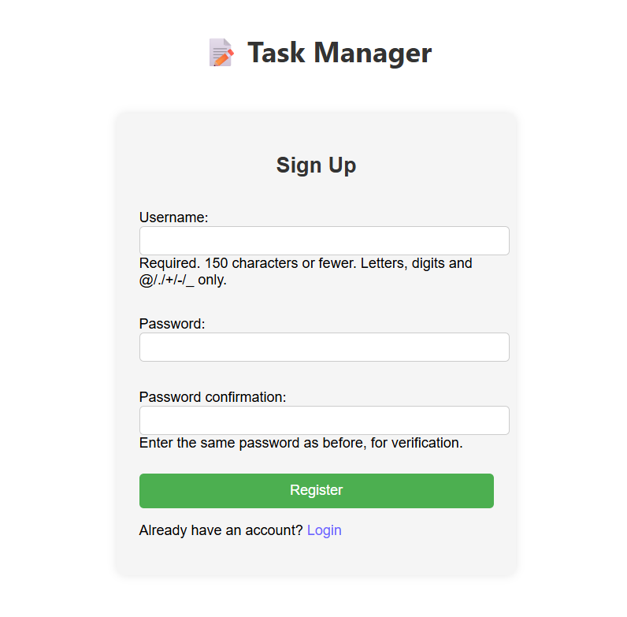
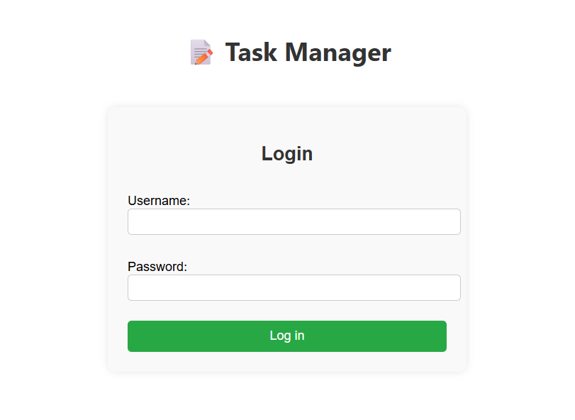
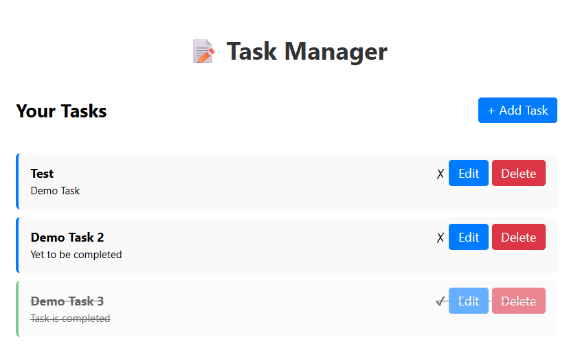

# ✅ Task Manager - Django Web Application

A simple yet functional Task Manager built using Django. This web application allows users to sign up, log in, and manage their tasks (add, update, delete, and mark as completed).

---

## 🔧 Features

- 👤 User Registration & Login (Authentication)
- ➕ Add New Tasks
- ✅ Mark Tasks as Complete/Incomplete
- ✏️ Edit Existing Tasks
- 🗑️ Delete Tasks
- 🧍 Personal Task Views (only see your own tasks)
- 🎨 Custom CSS Styling (No Bootstrap)

---

## 🖼️ Screenshots

| Sign Up | Login | Task Manager |
|--------|-----------|----------|
|  |  |  |

---

## 🏁 Getting Started

### 📦 Prerequisites

- Python 3.8+
- pip (Python package manager)
- Django 4.x or above

